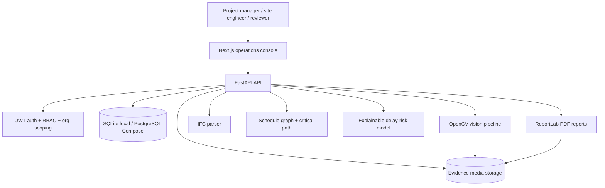
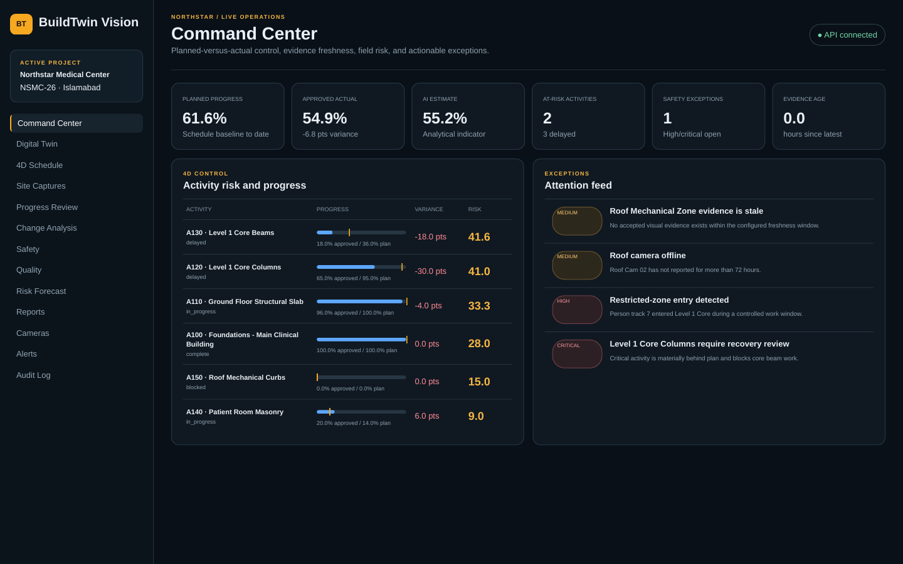
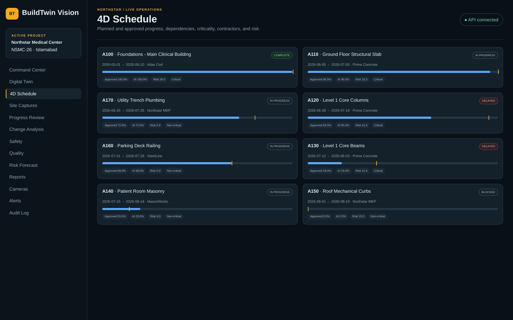
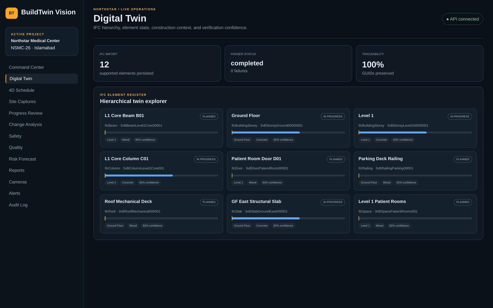
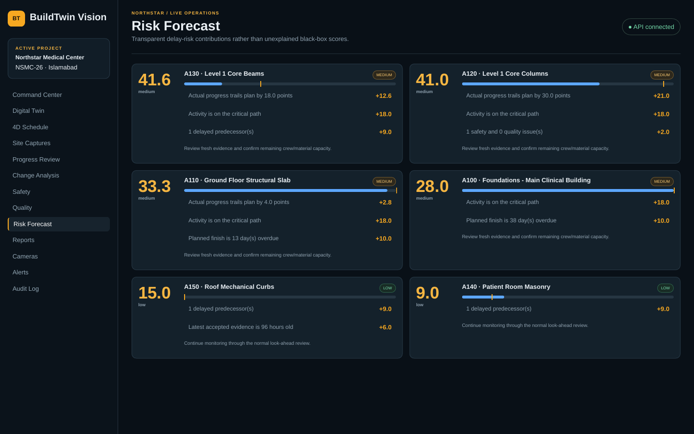
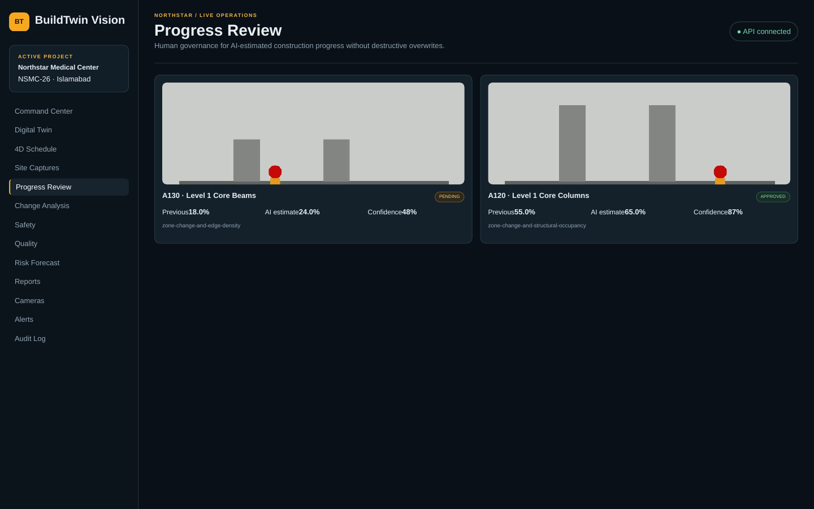
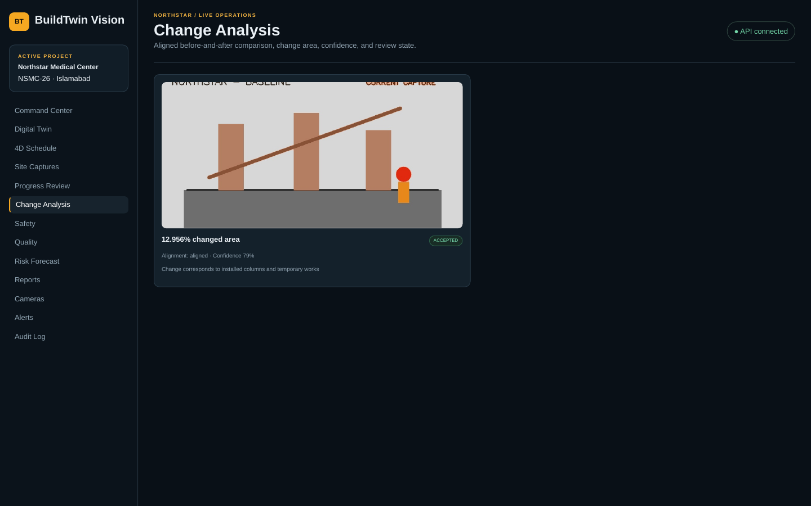

# BuildTwin Vision

[](LICENSE)
[](backend/pyproject.toml)
[](backend/app/main.py)
[](frontend/package.json)
[](docker-compose.yml)
[](https://github.com/HUSNAIN-MUNAWAR/buildtwin-vision/actions/workflows/ci.yml)

**Evidence-first 4D construction intelligence for BIM-linked progress tracking, visual verification, safety/quality review, delay-risk forecasting, and auditable reporting.**

BuildTwin Vision is a runnable full-stack construction-operations system. It connects a seeded project hierarchy, IFC elements, schedule activities and dependencies, OpenCV image/video processing, progress review, safety and quality exceptions, explainable risk, alerts, audit history, and PDF reporting.

The project is production-style open-source software, not a claim of turnkey enterprise readiness. Demo data is clearly labeled and generated locally.

## Why This Exists

Construction teams often manage BIM, schedules, visual evidence, field exceptions, and reporting in separate tools. BuildTwin Vision demonstrates how those records can be joined into an auditable digital-twin workflow where automated observations are useful, but human approval remains the source of truth.

## Features

- FastAPI API with JWT authentication, PBKDF2-SHA256 password hashing, role checks, organization scoping, correlation IDs, health/readiness endpoints, upload validation, and audit records.
- SQLAlchemy domain model for organizations, users, projects, buildings, floors, zones, BIM models/elements, schedule activities/dependencies, media, jobs, comparisons, progress, safety, quality, risk, alerts, audit events, and reports.
- Lightweight IFC STEP ingestion with GUID preservation, supported-entity persistence, partial-failure reporting, and an adapter boundary for future IfcOpenShell integration.
- CSV/JSON schedule validation with duplicate checks, date validation, predecessor validation, circular dependency detection, dependency graphing, and critical-path approximation.
- Real OpenCV MP4 decoding, frame sampling, image alignment, thresholded change masks, morphology/noise filtering, change overlays, confidence scoring, and review state.
- Human-reviewed progress approval that keeps AI-estimated and approved progress separate and writes audit events on review decisions.
- Explainable 0-100 delay-risk scores with named factor contributions and recommendations.
- Next.js operations console covering landing, login, command center, digital twin, 4D schedule, captures, progress review, changes, safety, quality, risk, reports, cameras, alerts, and audit pages.
- PDF weekly progress report generated from persisted KPIs, activity risks, and alerts.

## Architecture



See [docs/ARCHITECTURE.md](docs/ARCHITECTURE.md) for system, container, media-processing, BIM-ingestion, review, deployment, and entity diagrams.

## Screenshots

The included screenshots are generated from the authenticated Northstar demo API data and generated evidence files. They are stored in [screenshots/](screenshots/) and intentionally avoid secrets, tokens, private paths, or real customer data.

| Command center | 4D schedule |
|---|---|
|  |  |

| Digital twin | Risk forecast |
|---|---|
|  |  |

| Progress review | Change analysis |
|---|---|
|  |  |

Additional screenshots: [landing](screenshots/landing.png), [login](screenshots/login.png), [captures/cameras](screenshots/cameras.png), [safety](screenshots/safety.png), [quality](screenshots/quality.png), [reports](screenshots/reports.png), [alerts](screenshots/alerts.png), and [audit](screenshots/audit.png).

## Demo Data

The seeded **Northstar Medical Center Expansion** demo includes:

- 3 buildings, 5 floors, 7 physical zones, and 12 work packages.
- 12 parsed IFC records from a generated minimal IFC STEP file.
- 8 schedule activities with finish-to-start dependencies.
- Demo images, MP4 video, sampled frames, a change overlay/mask, and a generated PDF report.
- One delayed critical activity, one blocked downstream workfront, one restricted-zone event, one offline camera, one low-confidence observation, one approved observation, one rejected quality candidate, one open corrective action, one completed processing job, and one failed job with a realistic validation reason.

## Technology Stack

- **Backend:** Python 3.12, FastAPI, SQLAlchemy, Alembic, Pydantic, PyJWT, OpenCV, NumPy, NetworkX, Shapely, ReportLab, pytest, Ruff, mypy.
- **Frontend:** Node.js 22+ recommended, Next.js 16, React 19, TypeScript, ESLint, Node test runner.
- **Data/runtime:** SQLite for local development, PostgreSQL and Redis through Docker Compose, filesystem-backed demo media storage.
- **Infrastructure:** Docker Compose, Nginx config, GitHub Actions CI.

## Quick Start

Backend:

```bash
cd backend
python -m venv .venv
# Linux/macOS
source .venv/bin/activate
# Windows PowerShell
# .venv\Scripts\Activate.ps1
pip install -e ".[dev]"
alembic upgrade head
python -m app.cli reset-seed
uvicorn app.main:app --reload --port 8000
```

Frontend:

```bash
cd frontend
npm ci
npm run dev
```

Open `http://localhost:3000`. API documentation is available at `http://localhost:8000/docs`.

Demo credentials:

```text
Email: admin@buildtwin.local
Password: BuildTwin123!
```

Additional seeded users: `reviewer@buildtwin.local` and `safety@buildtwin.local`, both using the same local-only password.

## Configuration

Copy the example file before using Docker or external services:

```bash
cp .env.example .env
```

| Variable | Purpose | Local default |
|---|---|---|
| `DATABASE_URL` | SQLAlchemy database URL | SQLite file in `backend/buildtwin.db` |
| `JWT_SECRET` | JWT signing secret | Development-only fallback in code; set a strong value outside demos |
| `MEDIA_ROOT` | Root for sample/uploaded media | `sample_data/` |
| `MAX_UPLOAD_BYTES` | Upload size limit | `104857600` |
| `NEXT_PUBLIC_API_URL` | Frontend API base URL | `http://localhost:8000/api/v1` |
| `POSTGRES_DB`, `POSTGRES_USER`, `POSTGRES_PASSWORD` | Compose PostgreSQL settings | Demo values only |
| `REDIS_URL` | Queue/cache adapter URL | `redis://redis:6379/0` |

Never commit real `.env` files, credentials, tokens, production databases, or private media.

## Docker

```bash
cp .env.example .env
docker compose up --build
```

The default Compose stack runs PostgreSQL, Redis, the FastAPI API, and the Next.js web app. `docker-compose.dev.yml` demonstrates SQLite-backed hot reload for local development.

## CLI

The backend includes a small administrative CLI:

```bash
cd backend
python -m app.cli init-db
python -m app.cli seed
python -m app.cli reset-seed
```

`reset-seed` recreates deterministic demo records and generated evidence outputs.

## API Examples

```bash
curl http://localhost:8000/api/v1/health
```

```bash
TOKEN=$(curl -s http://localhost:8000/api/v1/auth/login \
  -H "Content-Type: application/json" \
  -d '{"email":"admin@buildtwin.local","password":"BuildTwin123!"}' \
  | jq -r .access_token)

curl "http://localhost:8000/api/v1/dashboard/executive?project_id=1" \
  -H "Authorization: Bearer $TOKEN"
```

More endpoint notes are in [docs/API_GUIDE.md](docs/API_GUIDE.md).

## Validation Commands

Backend:

```bash
cd backend
pip install -e ".[dev]"
alembic upgrade head
python -m app.cli reset-seed
ruff check app tests
mypy app --no-incremental --follow-imports=skip
pytest
python ../scripts/smoke_api.py
```

Frontend:

```bash
cd frontend
npm ci
npm run lint
npm run typecheck
npm run test
npm run build
```

Docker:

```bash
docker compose config
docker compose build
```

See [docs/TESTING.md](docs/TESTING.md) and [docs/VERIFICATION.md](docs/VERIFICATION.md) for current validation details and environment-specific limitations.

## Project Structure

```text
backend/app/       FastAPI routes, domain persistence, CV, BIM, schedule, risk, reports
backend/tests/     API, engine, integration, and workflow tests
frontend/src/      Next.js operations interface
frontend/tests/    Navigation smoke tests
sample_data/       Demo IFC, schedule, images, MP4, processing output, PDF
infra/             Docker, Nginx, and monitoring adapters
docs/              Architecture, API, deployment, demo, security, testing, roadmap
screenshots/       Demo application evidence previews
scripts/           Smoke test, demo generation, and preview rendering helpers
```

## Security Notes

Implemented controls include password hashing, signed expiring JWTs, role-gated mutations, organization scoping, safe upload filenames, upload size/type validation, fixed media roots, CORS allowlisting, common security headers, and audit logging.

Before production use, add managed secrets, HTTPS, SSO or refresh-token rotation, rate limiting, malware scanning for uploads, object storage, database least privilege, centralized logging, backups, dependency/container scanning, and formal authorization tests. See [SECURITY.md](SECURITY.md).

## Limitations

- Demo computer-vision outputs are deterministic examples, not a trained construction defect or safety model.
- Camera-to-BIM geometric registration is represented through zone links rather than full calibrated spatial registration.
- Local jobs run synchronously through the same persisted `ProcessingJob` contract; production queue workers are documented but not implemented.
- Docker Compose is configured, but Docker must be installed locally to run container checks.
- Demo credentials and generated data are for local development only.

## Roadmap

- Add calibrated camera-to-BIM registration and richer spatial reasoning.
- Replace synchronous local processing with a Celery, Dramatiq, or RQ worker adapter.
- Add object storage and signed media URLs.
- Expand IFC parsing through IfcOpenShell when available.
- Add browser-based E2E tests for critical reviewer workflows.
- Add production-grade identity-provider integration.

## Contributing

Contributions are welcome. Please read [CONTRIBUTING.md](CONTRIBUTING.md), keep changes focused, include relevant tests, and avoid hardcoded dashboard values or unlicensed media.

## License

BuildTwin Vision is released under the [MIT License](LICENSE).

## Attribution

This project uses open-source Python and JavaScript libraries listed in [backend/pyproject.toml](backend/pyproject.toml) and [frontend/package.json](frontend/package.json). Demo data, images, videos, IFC records, and reports are generated for this repository and are not copied from real customers or unrelated products.
