# Architecture

## System context

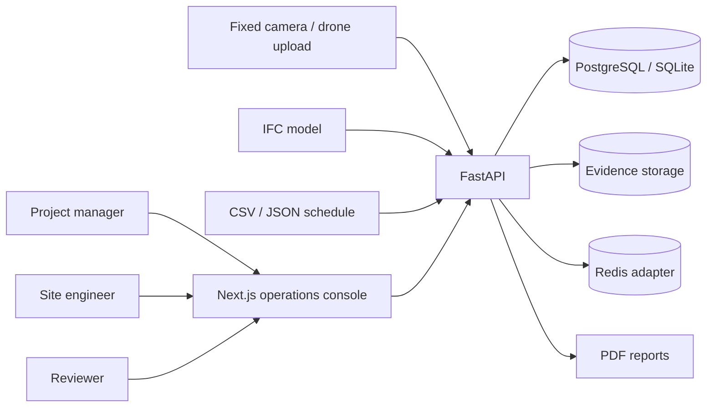

## Container architecture

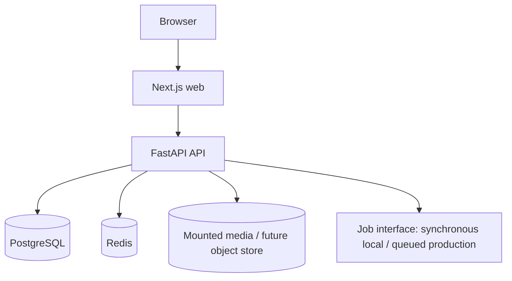

## Backend modules

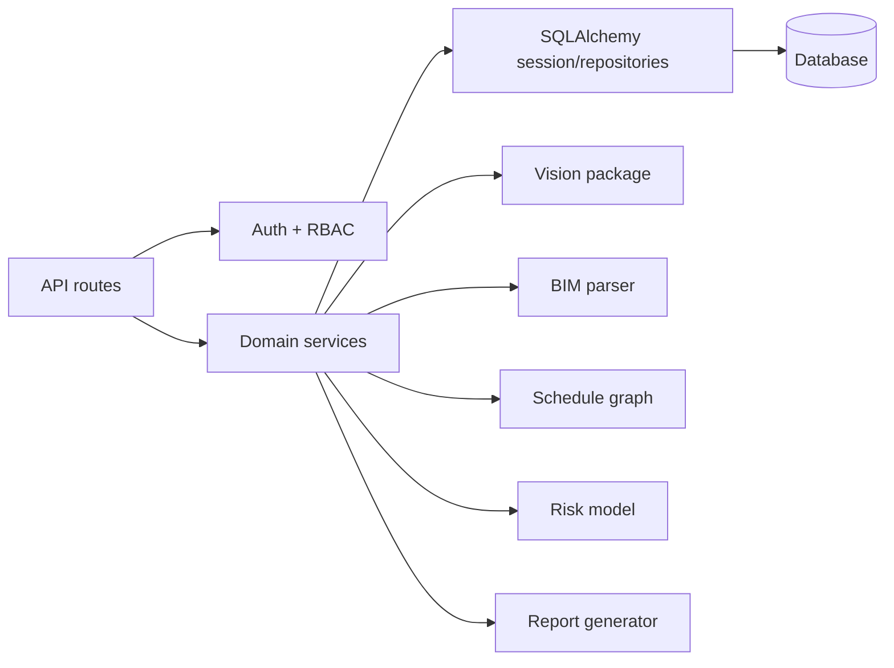

## Media-processing pipeline

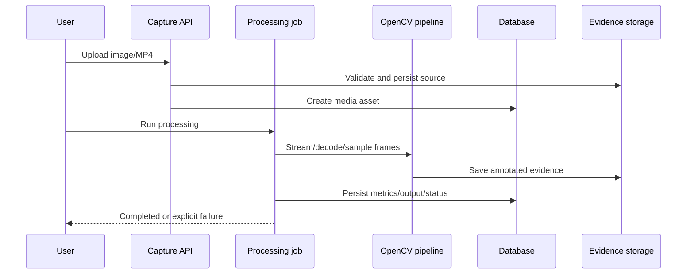

## IFC-ingestion pipeline

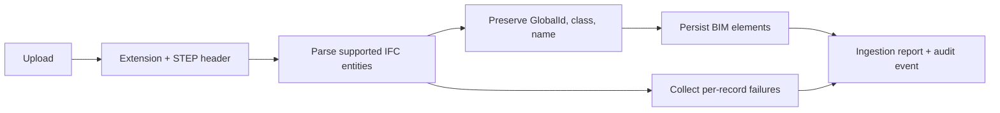

## 4D progress calculation

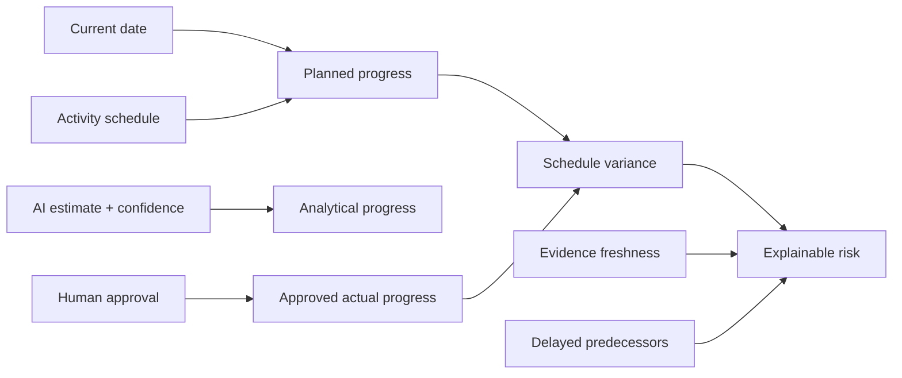

## Safety-event lifecycle

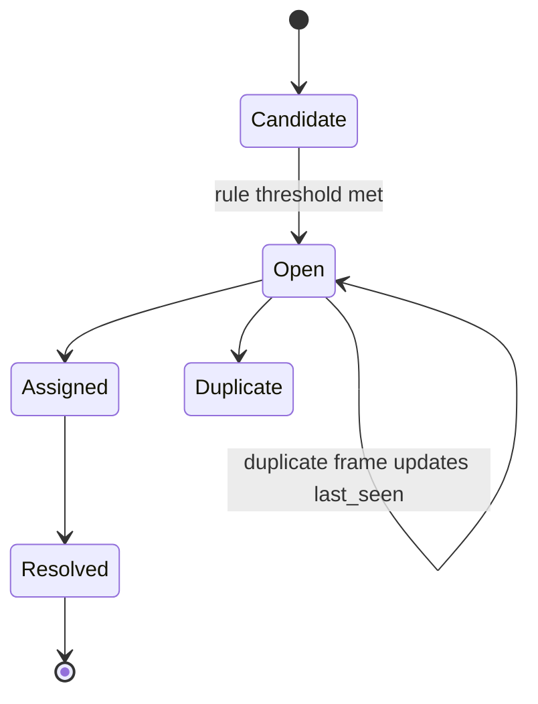

## Human-review workflow

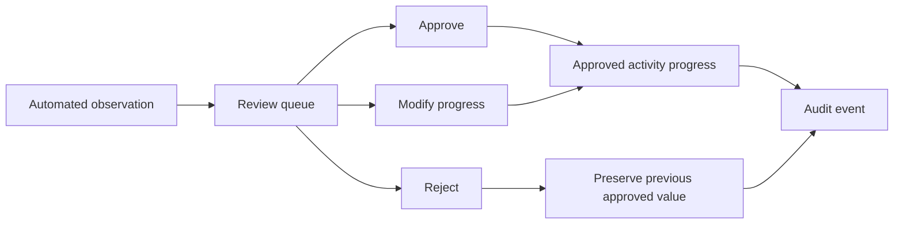

## Schedule dependency graph

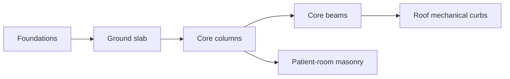

## Deployment

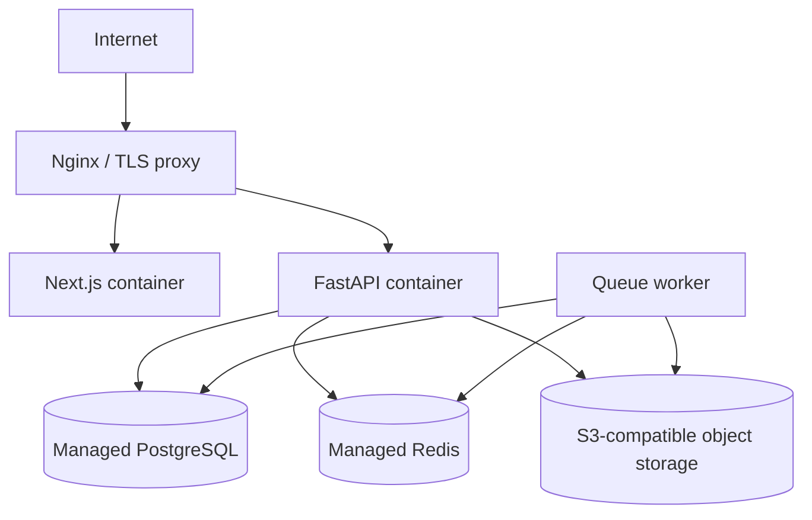

## Entity overview

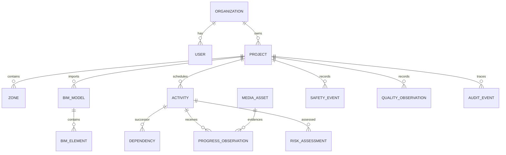

## Capture-to-approved-progress sequence

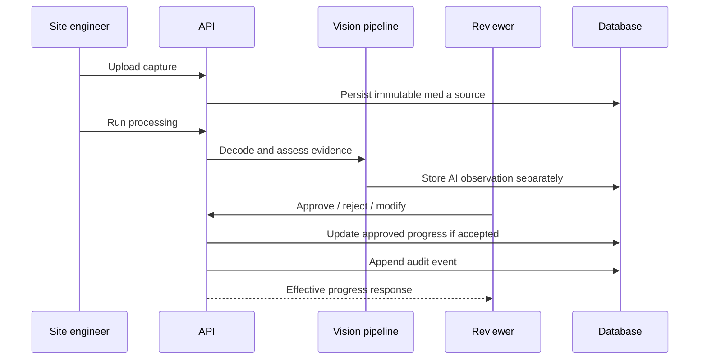

## Important decision

Local development executes jobs synchronously through the same persisted `ProcessingJob` contract. Production can replace the executor with Celery, Dramatiq, or RQ without changing observation, audit, or UI contracts.
